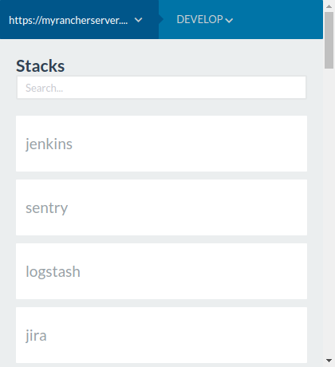
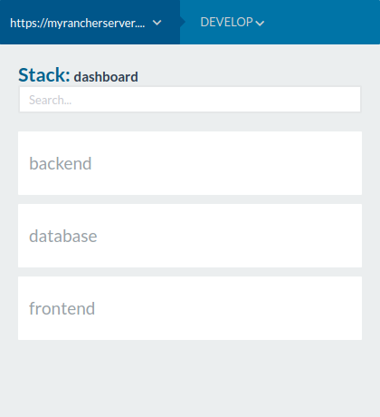
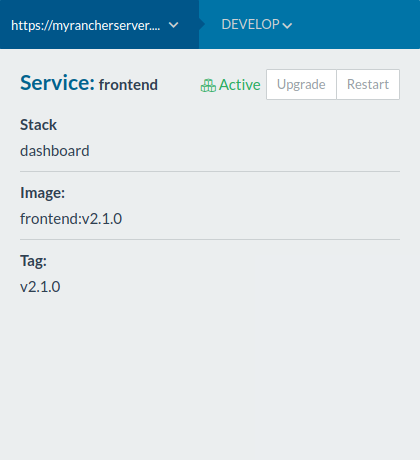
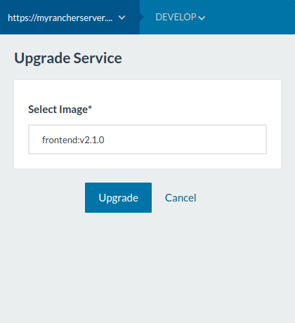

# Rancher Lite

Browser extension to manage multiple rancher servers.

## Install

- [Chrome extension](https://chrome.google.com/webstore/detail/rancher-lite/mdbboaciikfffcenfdlhkemdniabcbld)
- [Firefox add-on](https://addons.mozilla.org/en-US/firefox/addon/rancher-lite)

## Features
  - Access multiple rancher servers
  - Restart, upgrade and finish the upgrade of a service

## Screenshots

## Notes

The style used in this project is from https://github.com/rancher/ui
